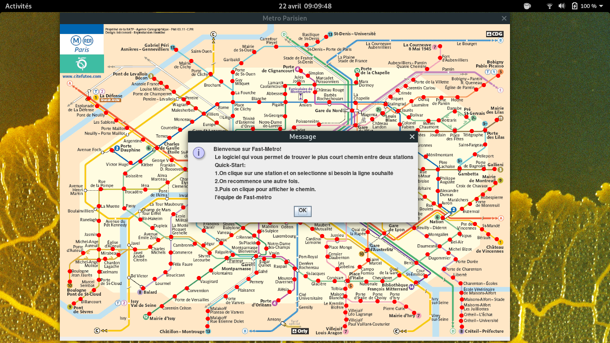

# Fast-Metro

Je présente en premier lieu la structure global du projet, ensuite je rentre un peu plus dans les détails notament l'algorithme de Dijkstra et enfin vous retrouverez quelques captures d'écran de l'application. 

## Présentation du logiciel
Fast-Metro est un logiciel permettant de trouver le plus court chemin entre deux stations de métro. Ce logiciel est programmée avec Java, j'utilise: Jframe (bibliothèque graphique native de Java), Maven (pour les dépendances) et du standard Json, librairie Gson (lire et écrire sur un fichier) pour faciliter les transferts de données.

# Execution
Avoir installer la machine virtuelle java pour l'execution des logiciels java, puis:
java -jar releases/app/\*.jar

# Mode d'Emploi
On selectionnne les deux stations qu'on souhaite voir le plus court chemin. Si on est dans une gare traversée par plusieurs stations, on selectionne la ligne souhaité via un menu déroulant. On clic. Le logiciel va afficher le plus court chemin. On clic pour reinitialiser la carte. 

# Explication de la structure du projet global
Voici un résumé de la structure du projet:

1) fastmetro package: contient la classe main et les classes de structures de données
	a) Main.java: class principal.
	b) Carte.java: Tous ce qui concerne la carte, la liste des gares, des stations et les appelle vers fenêtre.
	c) Station.java: Tous ce qui concerne une station (numéro de la stations,ligne). Un station est traversée par une ligne dans les deux sens de circulations. Elle hérite d'une gare pour pouvoir obtenir l'identifiant de la gare dont laquelle est affecté.
	d) Gare.java: Une gare est un ensemble de stations. Elle contient un nom et une liste de stations.
	e) Lecture.java: Pour lire un fichier json dans le système de fichier.
	f) Dijkstra.java: Implémentation de l'algo et utilisation d'un tableau pour faire les opérations.
  g) CouplePereTemps.java: Un couple de valeur. Utiliser pour dijkstra.

2) GUI package: c'est pour l'interface graphique de l'utilisateur (voir dans la javadoc dans Documentation/index.html avec un navigateur pour plus de detail). Mais en gros, on a une fenetre, un panel(station pannel) pour dessiner les stations(changer les couleurs etc...), circle qui représente un cercle utiliser pour l'affichage des stations et une classe de clique mise sur écoute. 

### \# Je détaille ici l'implémentation:

# Algorithme du plus court chemin: Dijkstra

## Structure de données
Pour la structure de donnée il fallait une structures ou l'on peut faire des opérations dynamique et avoir accés facilement à une données. J'ai donc utiliser une table de hachage avec une clé (un sommet, qui est l'identifiant d'une station) pour chercher facilement une valeur (pour supprimer et ajouter) et un couple de père/temps. 
J'ai donc deux table de hachage que j'ai appellé matriceDijkstra\_atraiter qui contient les valeurs que l'on a besoin de traiter et une autre matriceDijsktra\_res qui est le résultat du plus court chemin.

## Dérouler de l'algorithme
Voici l'algo adapter pour le programme, elle se déroule en deux temps, on cherche les valeurs des plus courts chemin que l'on met dans la table res:

- On ajoute la station de départ dans la table a traiter (elle devient la station père).
- On boucle jusqu'a que la table a traiter soit vide:
- Pour chaque voisin du père:
- Si le voisin est dans la table res (Les voisins de S0 par exemple à pour voisin S1 et S2 et S1 à pour voisin S0 alors qu'il est déjà traiter) on ne fait rien.
- Si le voisin est dans la table a traiter et qu'on a trouver un plus court chemin on le rajoute sinon on ne fait rien.
- On met le père dans res et le minimum dans père. 

Et la deuxième étape s'agit de remonter de la station d'arriver pour aller à la station de départ en regardant les voisins de la table res. 

## Lecture
C'est simplement une deserialization d'un ensemble d'objet écrit en Json des toutes les stations. J'ai pas voulu refaire le graphe avec les stations, donc j'ai juste adapter grâce aux registres vim en le transformant en une matrice et je l'ai lu pour initiliser le graphe. Donc on a deux fichiers, un ensemble de stations et une autre pour le graphe.

## Carte
La carte contient deux listes: La liste des gares et la liste des stations avec leurs voisins. Les voisins des voisins n'ont pas de voisins, c'est juste à titre d'identifiant. Ils ont la même adresse que après lecture de fichier des stations. L'identifiant gare est sont emplacement dans la liste par ordre de lecture du fichier.

# Détail de l'utilisation de l'interface graphique
## clic
Le clic est mis en écoute. Quand on clic on fait appel à l'objet dijkstra initialisé dans la carte. Les tableaux sont temporaires et change à chaque itérations.
## Panel
On initilise la carte et les stations en même temps. On va juste changer un cercle pour changer sa couleur.
 
# Organisation du travail, du pourquoi il y a une interface graphique...
Voici l'organisation du travail

- Initialiser le projet
- Mode édition (pour init le json)
- convertir les fichiers txt en json (utilisation d'un petit programme pour le fichier des stations et utilisation des registres vim pour le graphe)
- Initialiser la carte
- Initialiser le graphe 
- Préparation de dijkstra, établir les structures de données
- Ecriture de l'algo
- afficher le chemin le plus court
- correction de données

# Annexe
## Documentation 
javadoc dans Documentation/index.html

## Screencapture

## Disponible sur github
\url{https://github.com/dytq/Fast-Metro}
